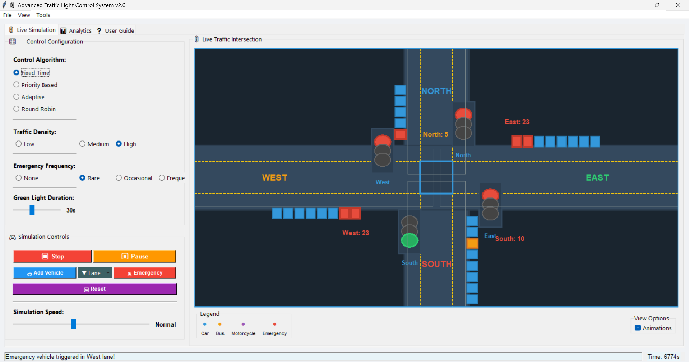
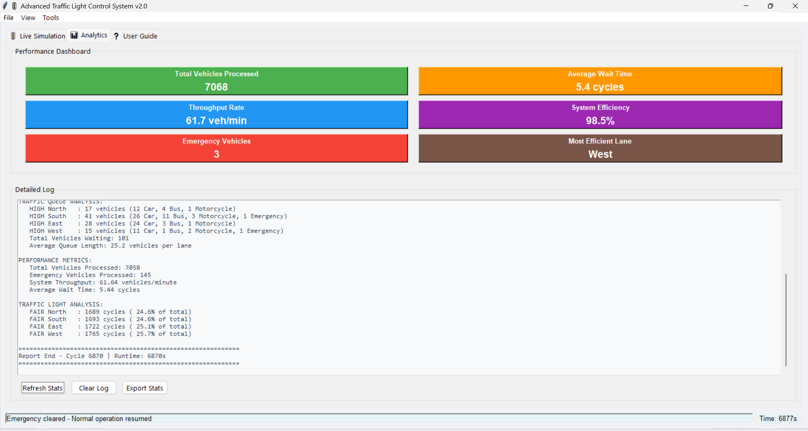

<div align="center">

# 🚦 Advanced Traffic Light Control System


We built this to answer a simple question — *what if you could actually see CPU scheduling algorithms working in the real world?*  
This simulator maps every classic OS scheduling concept onto a live 4-way traffic intersection, so you can watch them run, compare them, and actually understand the difference.

**[⬇️ Download & Run](#️-download--run) • [Screenshots](#-screenshots) • [How It Works](#-how-it-works) • [Algorithms](#-the-4-algorithms) • [OS Concepts](#-where-os-concepts-show-up)**

</div>

---

## 📸 Screenshots

| Live Simulation | Analytics Dashboard |
|---|---|
|  |  |

> The simulation tab shows real-time vehicle movement across all 4 lanes. The analytics tab tracks throughput, wait times, efficiency, and per-lane fairness — all updating live as the simulation runs.

---

## ⬇️ Download & Run

No Git required. Just download the zip, install Python, and run.

**Step 1 — Download the project**

Click the green **`Code`** button at the top of this page → **Download ZIP** → Extract the folder anywhere on your computer.

**Step 2 — Make sure Python is installed**

Download Python from [python.org](https://www.python.org/downloads/) if you don't have it. Version 3.10 or higher works best.  
To check if you already have it:
```bash
python --version
```

**Step 3 — No extra installs needed!**
This project uses only Python's built-in libraries. 
Just make sure you have Python 3.10+ installed
```

> Tkinter comes pre-installed with Python on Windows and macOS. On Linux run: `sudo apt-get install python3-tk`

**Step 4 — Launch the app**
```bash
python app.py
```

That's it. The simulation window opens immediately.

---

## 🎮 How to Use It

When you open the app, everything is on one screen. Left panel is your controls, right side is the live intersection.

**Configure before starting:**
- Pick one of the 4 **Control Algorithms** — this is the big one, it changes how the lights decide who goes next
- Set **Traffic Density** (Low / Medium / High) — controls how many vehicles spawn per cycle
- Set **Emergency Frequency** — how often an emergency vehicle appears
- Use the **Green Light Duration** slider to set how long each green phase lasts (default 30s)

**Run the simulation:**
- Hit **▶ Start** — vehicles start spawning and moving through the intersection
- **⏸ Pause** anytime to freeze the state and read the numbers
- **⏹ Stop** ends the session, **🔄 Reset** wipes everything back to zero

**While it's running:**
- Click **Add Vehicle** to manually drop a car into any lane
- Click **Emergency** to inject an emergency vehicle and watch the lights react in real time
- Use the **Lane** dropdown to pick which direction you're adding to

**Check your results:**
- Switch to the **Analytics** tab — you get a full performance dashboard
- Hit **Export Stats** to save everything as a **CSV file** for external analysis or comparison

---

## 📁 Project Structure

```
traffic-light-control-system/
│
├── app.py                          # Entry point — run this to start
│
├── core/                           # The simulation engine
│   ├── constants.py                # All configurable values in one place
│   ├── sim.py                      # Main loop, vehicle spawning, cycle management
│   └── state.py                    # Holds the live state of the whole simulation
│
├── algorithms/                     # Everything related to light control logic
│   ├── controller.py               # Picks and runs whichever algorithm is selected
│   └── strategies/
│       ├── base.py                 # Shared base class all algorithms extend
│       ├── fixed_time.py           # Fixed Time — equal green for everyone
│       ├── priority.py             # Priority — longest queue goes first
│       ├── adaptive.py             # Adaptive — scores each lane dynamically
│       └── round_robin.py          # Round Robin — strict rotation
│
├── services/
│   ├── stats.py                    # Calculates throughput, wait time, efficiency
│   └── exporter.py                 # Exports simulation data to CSV
│
├── ui/
│   ├── window.py                   # Main window, tab layout
│   ├── intersection_view.py        # The animated intersection canvas
│   ├── helptext.py                 # User guide tab
│   └── components/
│       ├── config_panel.py         # Algorithm & settings selectors
│       ├── control_panel.py        # Start/Stop/Pause/Reset/Add buttons
│       ├── performance_panel.py    # Analytics dashboard
│       ├── quick_stats.py          # Live stat cards at a glance
│       ├── details_log.py          # Full detailed log output
│       ├── legend.py               # Vehicle type color legend
│       ├── options.py              # Animation toggle
│       └── status_bar.py          # Bottom status messages
│
├── assets/                         # Screenshots for README
├── requirements.txt
└── README.md
```

---

## 🧠 The 4 Algorithms

This is the core of the whole project. Each algorithm is a different strategy for deciding which lane gets the green light next — and each one maps directly to a CPU scheduling algorithm from OS theory.

---

### 🔵 Fixed Time
Every lane gets the same amount of green time, no matter what. North gets 30s, then East, then South, then West, then repeat — forever. It doesn't matter if North has 10 cars backed up and East has zero. It's fair in the most rigid, inflexible sense.

```
North 30s → East 30s → South 30s → West 30s → North 30s → ...
```

Simple to understand, easy to predict, but wasteful when traffic is uneven.

---

### 🟡 Priority Based
Whichever lane has the most vehicles waiting right now gets the green light. Every cycle it checks all 4 queues and picks the winner. If two lanes are tied, it uses a tiebreaker.

```
every cycle:
    winner = lane with max(queue_length)
    give green → winner
```

Works well when traffic is clearly concentrated in one direction. Can cause other lanes to wait a long time if one lane constantly stays full.

---

### 🟢 Adaptive
This is the most sophisticated one. Instead of just checking queue length, it calculates a **score** for each lane every cycle using multiple factors — how many vehicles are waiting, how long they've been waiting, what types of vehicles they are, and whether a lane is being starved. The lane with the highest score gets green.

```
score = (queue_length × 2.0)
      + (wait_time × 1.5)
      + (vehicle_type_bonus)
      − (starvation_penalty if lane hasn't been green recently)
```

In practice this is the best performer — it gets close to 100% efficiency across most traffic conditions.

---

### 🟣 Round Robin
Pure rotation. North → East → South → West → North → ... Each lane gets exactly one turn before the cycle repeats. Nobody skips, nobody goes twice in a row.

```
turn = cycle_number % 4
green → lanes[turn]
```

Perfectly fair. Not perfectly efficient — but every lane is guaranteed a turn no matter what.

---

## 💡 Where OS Concepts Show Up

We didn't just put "applies OS concepts" in the description for fun. Here's exactly where everything maps:

| What you see in the simulator | What it is in OS theory |
|---|---|
| A lane (North / South / East / West) | A process waiting for CPU time |
| The green light | The CPU being allocated to a process |
| Fixed Time algorithm | FCFS — First Come First Served |
| Priority Based algorithm | Priority Scheduling |
| Adaptive algorithm | Multilevel Feedback Queue (MLFQ) |
| Round Robin algorithm | Round Robin Scheduling |
| Emergency vehicle arriving | A high-priority interrupt / real-time process |
| Emergency vehicle jumping the queue | Priority Inversion handling |
| Lane fairness metrics | Starvation detection |
| The starvation penalty in Adaptive | Aging — boosting long-waiting processes |
| All lanes guaranteed some green time | Deadlock / starvation avoidance |

The interesting part is watching Priority Based cause "starvation" in real time — if you set traffic density high and one lane gets heavy, the other lanes can sit at red for a very long time. Then switch to Adaptive and watch it recover. That's exactly what MLFQ does for processes in a real OS.

---

## 📊 What the Analytics Tab Shows

After running for a while, the Analytics tab gives you:

| Metric | What it means |
|---|---|
| **Total Vehicles Processed** | How many vehicles made it through the intersection |
| **Throughput Rate** | Vehicles per minute — the main efficiency number |
| **Average Wait Time** | How many cycles a vehicle waits before getting green |
| **System Efficiency** | Processed ÷ Generated × 100 — ideally 100% |
| **Emergency Vehicles** | Count of emergency vehicles handled |
| **Most Efficient Lane** | Whichever lane is moving vehicles the fastest |
| **Lane Fairness** | Green light distribution % across all 4 lanes |

You can hit **Export Stats** at any time to download a CSV with the full log — useful if you want to compare algorithms across multiple runs in a spreadsheet.

---

## 🔮 What We'd Add Next

- Pedestrian crossing signals
- Preemptive interruption — emergency vehicles cutting a green light short mid-cycle
- Multi-intersection network (not just one junction)
- Machine learning trained on real traffic patterns
- A side-by-side mode to run two algorithms simultaneously and compare live


<div align="center">

If this helped you understand scheduling algorithms better, leave a ⭐ — it means a lot to us.

</div>
